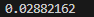
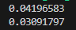
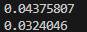

从`Lua5.4.3` fork而来。  
增加了`sharedata`到基本数据结构中。  
`sharedata`是一种类似table的只读存储结构，需要由一个已有table build生成。  
`sharedata`可以存储到文件，并且可以放入共享内存中由多进程访问。   
当试图生成一个短字符串对象并驻留时，会先到lua原本的stringtable中寻找，然后按照共享内存的添加顺序在那之中寻找。  

更详细的测试见`./testes/sharedata.lua`  

访问速度上，比原生的table略慢一些。  
测试方式为对于同样的数据遍历100次取时间均值，单位：s  

下图为lua5.4的table:  
  
以这个值为基础值  
  
  
下图分别为sharedata和table，且string指向的都是stringtable中的:  
  
分别为基础值的1.45和1.07倍  
  
  
下图分别为sharedata和table，且string指向的都是sharedata中的：  
  
分别为基础值的1.51和1.12倍  


API:
```
sharelib.buildFile(table:tb,string:path,integer:mode = 0)
把tb存储到路径path处的文件中。
mode = 0 ：覆盖原本文件
mode = 1 ：如果文件存在，则不做操作

返回值：
-1，失败
0，成功写入文件
1，文件已存在


sharelib.Get(string:path,integer:mode = 0)
从路径path加载一个上述文件到sharedata。
mode = 0: 不使用共享内存
mode = 1: 使用共享内存

返回值：
一个sharedata对象，失败返回nil


sharelib.getLock(string:path)
返回路径path的文件当前锁的状态。

返回值：
nil = 打开文件失败
-1 = 获取锁失败 
0 = 没有锁
1 = 有读锁
2 = 有写锁


sharelib.getData(sharedata:data)
从一个sharedata对象生成一个table对象。

返回值：
一个table对象
```

